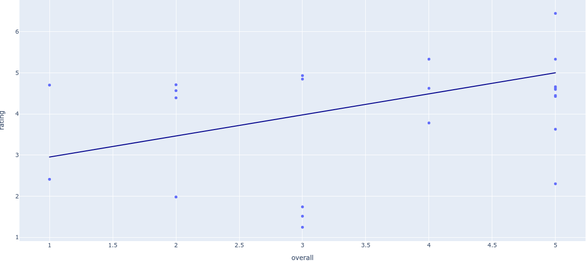

# Wordsmyth

Wordsmyth is a free and open-source tool to ease the pains of manual comment analysis among content creators and users.

Instead of relying on star ratings given by the user, Wordsmyth **generates them** based on the **text sentiment** using a pair of models and well-tested output finetuning.

## Highlights

- Works on almost any platform and very easy to extend
- 85-100% accuracy on Amazon reviews and sometimes more accurate than provided ratings (see [the caveats](#caveats))

## Status

Wordsmyth recently had a refactor to simplify the codebase and may continue to refactor, so expect changes to the documentation. Technically it is feature complete, but not production-ready.

## Usage

Wordsmyth is currently available as a pipeline to load comments from a data source and output star ratings.

Install the pre-requisites:

```bash
python3 -m venv venv
. venv/bin/activate
pip install -r requirements.txt
./helper model
```

You can now download some comments to test the pipeline. For instance, with the provided YouTube comment script:

```bash
python3 scripts/comments.py | jq > comments.json
```

Then pass the comments into either the `RateTable` or `RatePlot` pipeline:

```bash
python3 evaluate_comments.py RateTable --comments example.json
```

`RateTable` prints the head and tail of the evaluated reviews and prints a summary of the data. `RatePlot` generates an interactive plot of the evaluated reviews like below:

<div align=center>
    
</div><br>

Both of these pipelines use [Pickle](https://docs.python.org/3/library/pickle.html) files to persist the output data to be cached easily.

## Caveats

These are some imperfections with this algorithm since AI is not perfect.

### Vague comments

Comments like `ok` and `cheap` are impossible to infer without a user's star rating. The context of these reviews can't be discerned.

Examples:

| content       | predicted     | actual |
| ------------- | ------------- | ------ |
| ok part       | 4.0070        | 2      |
| cheap         | 4.5680        | 3      |
| ok            | 5.3333        | 3      |

The definition of an okay or cheap product is subjective, and Flair mostly leans toward the positive definition of these words. 

### References to other content

There are some reviews which quote other text such as a customer service email. Since Flair/TorchMoji can't understand the context of the quoted text, Wordsmyth will consider that text as part of the review and possibly alter the rating of the text.

| content       | predicted     | actual |
| ------------- | ------------- | ------ |
| Be careful, NewAir will not stand by their products. Our NewAir broke within the first 4 hours of use. The manufacturer will NOT cover the item under warranty. Just in case you're actually thinking of buying a NewAir product... think twice...\n\nFrom: NewAir Sales sales@newair.com\nDate: Fri, Nov 14, 2014 at 11:03 AM\nSubject: Re: Icemaker return... | 4.7040 | 1

This comment links a couple of emails outlining customer service which includes positive text like `Have a great day!` and `Thanks so much and I look forward to your response.`

### Irregular tone shifts in sentiment

Text that quickly changes in tone can sometimes be incorrectly predicted by the algorithm stack, especially in the case of Flair.

An example of this type of text would include:

| content       | predicted     | actual |
| ------------- | ------------- | ------ |
| works great. we loved ours! till we didn't. these do not last so buy the warranty as you WILL NEED IT. | 4.3935 | 2
| Luved it for the few months it worked! great little bullet shaped ice cubes. It was a gift for my sister who never opened the box. The next summer during a heat wave I asked for my unused gift back, ha!, and was in heaven for a few months. the next summer after a few weeks the unit gave out... | 4.7115 | 2 |

This is probably one of the more difficult issues to fix since the content can't be trimmed or normalized. Possible, this could be fixed be tokenizing the sentences instead of predicting the sentence as a whole.
