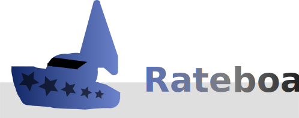

<h1 align="center">

</h1>

[](https://github.com/themysticsavages/rateboat/actions/)

Rateboat is a free and open source tool to ease the pains of manual comment analysis among content creators and viewers.

Here's it in a more relatable way:

Imagine you are looking for how to use and make APIs, some tutorial like:

<a href="https://www.youtube.com/watch?v=GZvSYJDk-us"></a>

You aren't really sure what to expect from the tutorial since it's over 2 hours long and covers a slightly specific topic. Sure, reading the first 10 comments may give you a general idea, but it's not necessarily covering all opinions.

With this tool, all the video comments are aggregated, analyzed for sentiment, and displayed in the most simple way - a rating.

Do you want to scavenge all those comments now?

## Status

Rateboat is currently in development and doesn't have a public API or a frontend, but it is stable for local use.

Please read the [`TODO.md`](./TODO.md) for specific things that still need to be implemented.

# Hosting

## Docker

You can spawn all the infrastructure with the prebuilt images on `ghcr.io` without cloning anything:

```bash
curl https://raw.githubusercontent.com/themysticsavages/rateboat/\
     main/docker-compose.images.yml
docker-compose up -f docker-compose.images.yml -d
```

or build and run it yourself:

```bash
git clone https://github.com/themysticsavages/rateboat --depth=1
cd rateboat
docker compose up -d --build
```

You should be able to queue an endpoint from the web API:

```bash
$ curl -X POST http://localhost:8081/youtube/queue \
     -H "Content-Type: application/json" \
     --data '{"video_id": "Rg8-9nc-y-U"}'
{"status": "success"}
```
