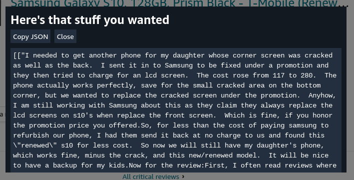

# Wordsmyth

  [](https://github.com/lemystic/wordsmyth/actions/)

Wordsmyth is a free and open-source tool to ease the pains of manual comment analysis among content creators and users.

Instead of relying on star ratings given by the user, Wordsmyth **generates them** based on the **text sentiment** using a pair of models and well-tested output finetuning.

## Highlights

- Works on almost any platform and very easy to extend
- 85-100% accuracy (tested against Amazon reviews) and sometimes more accurate than user ratings
- Accessible to anybody (planned browser extension, web dashboard, API, and command line)

## Status

Wordsmyth is under active development and somewhat close to stable use.

Please read the [`TODO.md`](./TODO.md) for specific things that still need to be implemented.

# Usage

This section is for self-hosting the services to do your own indexing. Every quickstart uses Docker, and you should [install it](https://docs.docker.com/engine/install/) for consistent behavior.

## Web API

Make sure you have a `.env` file in the same directory with API keys for the respective platforms you want to support. Leaving a key value blank will simply close the route. You can follow the `.env.sample` for what you should put.

You can spawn all the infrastructure with prebuilt images from GHCR without cloning anything:

```bash
curl "https://raw.githubusercontent.com/lemystic/wordsmyth/main/docker-compose.images.yml" > docker-compose.yml
docker compose up -d --build
```

or build and run it yourself:

```bash
git clone https://github.com/lemystic/wordsmyth --depth=1
cd wordsmyth
docker compose up -d --build
```

You should be able to queue an endpoint from the web API with either method:

```bash
$ curl -X POST http://localhost:8081/youtube/queue \
     -H "Content-Type: application/json" \
     --data '{"video_id": "Rg8-9nc-y-U"}'
{"status": "success"}
```

## Command line

> **Note:**
> The newer pipelines are completely brand new. If you would like a less bleeding-edge method, please refer to the stable CLI documentation [here](./docs/cli.md).

You can use the in-progress pipeline to simplify the process (at `future/pipeline/`).

Any data source is allowed for testing, but Amazon reviews are recommended since they are much more serious and detailed. You can install the userscript for collecting reviews at `media/copyReviews.js`, then go to a product page like [this one](https://www.amazon.com/Samsung-Galaxy-G973U-128GB-T-Mobile/product-reviews/B07T8CN8WZ?ie=UTF8&reviewerType=all_reviews&pageNumber=1). Trigger the userscript by appending `&pageMacro=<end_page>`. You should expect a dialog like below:



Go to `future/pipeline`, paste the scraped reviews into a `comments.json`, then run the pipeline:

```bash
python3 evaluate_comments.py --local-scheduler PrintComments
```
