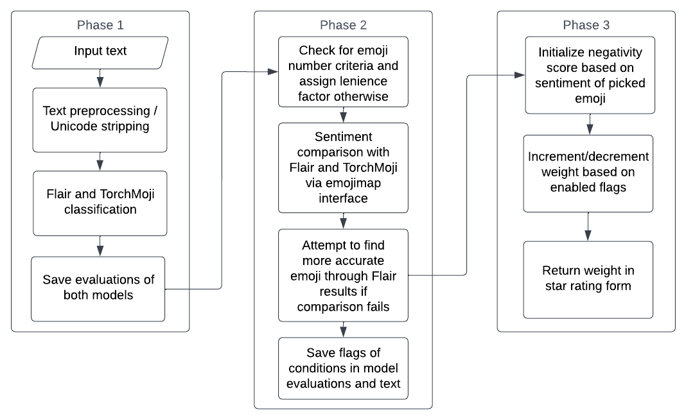

<picture>
<source media="(prefers-color-scheme: dark)" srcset="./media/logo_dark.svg" width=130 align=right />

</picture>

# Wordsmyth

Wordsmyth eases the pains of manual comment analysis among content creators and users.

Instead of relying on star ratings given by the user, Wordsmyth *generates them* based on the text sentiment by applying pre-trained neural network results to deterministic rules. This combination of data analysis results in high-accuracy rating prediction that is mostly unbiased.

<div align="center">

</div>

Wordsmyth has relatively good performance across different types of content, from YouTube comments to Amazon reviews.

## Usage

Download the TorchMoji model locally:

```bash
curl https://www.dropbox.com/s/q8lax9ary32c7t9/pytorch_model.bin?dl=0 -L --output src/wordsmyth/data/pytorch_model.bin
```

Install your preferred version of [PyTorch](https://pytorch.org/get-started/locally/#start-locally). Most people will go with the latest version, but `1.13.1+cpu` seems to have the smallest package size:

```bash
pip install torch==1.13.1+cpu -f https://download.pytorch.org/whl/cpu/torch_stable.html
```

Install wordsmyth:

```bash
pip install -e .

# comes with conjugation detection for increased accuracy
# installs spacy and nltk
pip install -e ".[cc]"
```

and use the module like so:

```py
from wordsmyth import rate

rating = rate("Hello world")
print(rating, "stars") # 5 stars

rating, flags = rate("Hello world", flags=True)
print(flags) # [content flags ...]
```

There are also scripts to download reviews and benchmark this algorithm in `scripts/`. (they need some updating though)