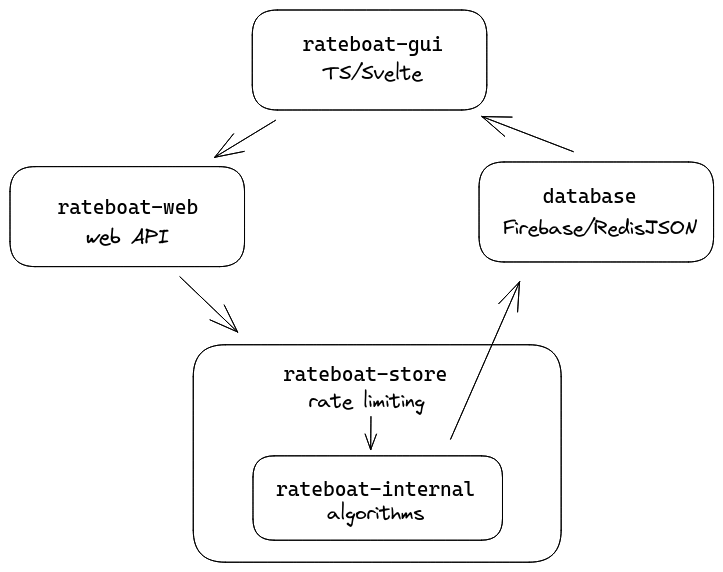

# Architecture

- `rateboat-gui`: A frontend website with TypeScript and SvelteKit to submit content for review
- `rateboat-web`: A web API in Python with FastAPI
- `rateboat-store`: The outer protection layer for...
- `rateboat-internal`: The algorithm services which are used for analysis
- `auto-indexer`: A content crawler which submits to `rateboat-store`

Making requests to process videos is done with two Python gRPC services: one for handling the state of processing, `rateboat-store`, and another to actually process the data, `rateboat-internal`.

`rateboat-store` acts as a barrier to the inner service to prevent users from sending identical videos to be processed. 

This uses an in-memory state to keep track of what content is being processed and every request sent to the store is run in a new thread. This is most likely safe on memory and threads.

`rateboat-internal` hosts the algorithms needed for processing data, which you can find more info about [here](./docs/ALGORITHMS.md).

Upon receiving a request from `rateboat-store`, it will request to generate an [SSE](https://en.wikipedia.org/wiki/Server-sent_events) route directly on `rateboat-web` to push processing updates and results to the client.
